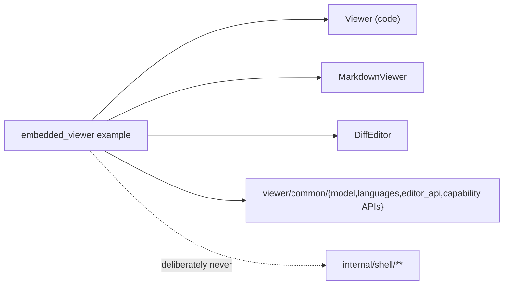

# internal/shell/examples/embedded_viewer

Minimal JS embedding proof for the reusable `viewer`. It uses in-memory files
and an in-memory `WorkspaceTreeProvider`; no workbench, remote protocol, server,
or WebSocket participates.

> The code blocks on this page are `mbt nocheck`. This package is js-only and
> its values need a live DOM, which `moon test` (Node, no DOM) cannot provide.
> Its executable coverage is the Playwright suites under `tests/browser/`; see
> `docs/harness.md` for how to choose a test layer.



This example exists to keep the *external* embedder surface compiling: it
imports only what a third-party host is allowed to import, so a change that
forces embedders through a private package breaks the build here first.

```mbt nocheck
// The whole embedding surface an external host needs.
let viewer = @viewer.Viewer::create(host)
viewer.set_model(Some(@model.TextModel(uri, name, "moonbit", 1, "rev-1", text)))

let markdown = @viewer.MarkdownViewer::create(markdown_host)
markdown.set_model(Some(@viewer.MarkdownViewerModel(model, OrdinaryMarkdown)))

let diff = @viewer.DiffEditor::create(diff_host)
diff.set_model(Some(@viewer.DiffEditorModel(original, modified)))
```

## Flow

- Startup registers the MoonBit tokenizer in the default `Languages` registry.
- `FileTree.on_open` asks the in-memory host for a new
  `viewer/common/model.TextModel`. Lowercase `.md` paths or the `markdown`
  language id go to a dedicated `MarkdownViewer`; `.mbt.md` selects
  `MoonBitMarkdown`. Every other model goes to the code-only `Viewer`.
- Each surface captures the attached URI and schedules one native animation
  frame after its own DOM work. The callback rechecks the current model URI,
  drops stale swaps, then drives `FileTree::set_active` (`autoReveal`) and the
  `ready` status.
- `DiffEditor` receives an atomic original/modified pair. A real replacement
  returns the fully detached old pair for immediate disposal; an exact same-pair
  no-op returns `None`, so active models are never retired accidentally.
- Rabbita renders stable, childless code, Markdown, and diff hosts; after the
  first paint the host mounts the imperative surfaces through their independent
  public facades.

This is the standalone-host boundary: the host owns storage, model creation,
selection, and feature registration; the viewer owns its DOM subtree.
`public_api_contract.mbt` is referenced but not executed; it keeps the opaque
options/services facades, common capability handles, root widget/zone factories,
and independent Code/Markdown/Diff contracts compiling without importing
browser internals.

## Validation

`just dist-front-end` emits `web/dist/embed.{html,mjs}`. The host server serves
`/embed.html`; `tests/browser/smoke/embed.spec.js` covers explicit Code and
Markdown routing, DiffEditor responsive/Inline/navigation/accessibility
contracts, lazy expansion, stale ready callbacks, and the absence of a
WebSocket.
