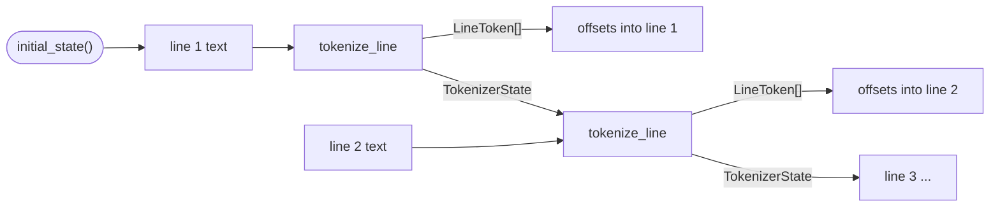

# syntax

Stateful lexical highlighting for readonly text. It keeps Monaco's line-tokenizer
architecture but replaces runtime Monarch grammars with MoonBit `lexmatch` code.

## The line-at-a-time contract

A tokenizer never sees the document. It sees one line plus the state the
previous line left behind, and it returns tokens plus the state for the next
line. That is what makes incremental re-tokenization possible: re-lexing line
*n* only requires the state at line *n*, not a whole-file reparse.



- `LineTokenizer::tokenize_line` receives one line plus `TokenizerState` and
  returns `LineToken[]` plus the state for the next line. Token offsets are UTF-16
  code units; gaps are rendered as plain text.

A registry miss is encoded by the model tokenization part as one default token
per line; `syntax` does not install a fallback tokenizer. A small stateless
implementation is available separately as the
[`examples/plain_tokenizer`](./examples/plain_tokenizer/README.mbt.md) package.
It is reference code for implementing `LineTokenizer`, not part of this
package's interface.

Gaps between tokens are legal and are rendered as plain text, so a tokenizer
only has to emit the spans it actually recognizes.

```mbt check
///|
priv struct KeywordOnly {}

///|
impl @syntax.LineTokenizer for KeywordOnly with fn initial_state(_self) {
  TokenizerState()
}

///|
impl @syntax.LineTokenizer for KeywordOnly with fn tokenize_line(
  _self,
  line_text,
  state,
) {
  let tokens : Array[@syntax.LineToken] = []
  // Only "let" is claimed; every other column is left as a gap.
  if line_text.has_prefix("let") {
    tokens.push({ start: 0, end: 3, tag: Keyword })
  }
  (tokens, state)
}

///|
test "unclaimed columns stay as gaps rather than forcing a Plain token" {
  let tokenizer : &@syntax.LineTokenizer = KeywordOnly::{  }
  let (tokens, _) = tokenizer.tokenize_line(
    "let x = 1",
    tokenizer.initial_state(),
  )
  debug_inspect(
    tokens,
    content=(
      #|[{ start: 0, end: 3, tag: Keyword }]
    ),
  )
}
```

## The registry

- `TokenizationRegistry` registers tokenizers by language id and emits
  `TokenizationChangedEvent { changed_languages, changed_color_map }`.
  Registration, replacement, explicit `handle_change`, and active removal emit
  exact language-id arrays with `changed_color_map=false`; disposing a stale
  registration is inert. `get` returns the current synchronous support and
  `is_resolved` is always true because this package has no lazy factory state.

`tokenization_registry` is process-wide. `Languages::set_tokens_provider`
forwards into it; `viewer/common/model` performs the state-threaded
per-line encoding, passive storage reads, and explicit/visible/background
demand scheduling. The examples below build their own registry so they do not
touch that process-wide value.

```mbt check
///|
test "registration and removal emit exact language-id arrays" {
  let registry = @syntax.TokenizationRegistry()
  let events = []
  registry.on_did_change(event => {
    events.push((event.changed_languages, event.changed_color_map))
  })
  |> ignore
  let registration = registry.register("json", KeywordOnly::{  })
  let found = registry.get("json") is Some(_)
  let missing = registry.get("moonbit") is Some(_)
  registration.dispose()
  let after_removal = registry.get("json") is Some(_)
  // Disposing an already-removed registration is inert.
  registration.dispose()
  debug_inspect(
    (events, found, missing, after_removal),
    content=(
      #|([(["json"], false), (["json"], false)], true, false, false)
    ),
  )
}
```

`is_resolved` reports `true` for any language, registered or not, because there
is no lazy factory that could still be pending.

```mbt check
///|
test "is_resolved is unconditionally true" {
  let registry = @syntax.TokenizationRegistry()
  registry.register("json", KeywordOnly::{  }) |> ignore
  debug_inspect(
    (registry.is_resolved("json"), registry.is_resolved("never-registered")),
    content=(
      #|(true, true)
    ),
  )
}
```

Monaco's registry `Color[] | null` / `Color | null` surface is deliberately
reduced to `Array[String]?` / `String?`. Entries are retained, unparsed CSS
color expressions. `set_color_map(Array[String])` emits every active language
with `changed_color_map=true`; `get_color_map()` returns the retained option;
`get_default_background()` returns literal index 2 only when the array length
is greater than 2. No `Color` object behavior or identity is exposed.

```mbt check
///|
test "the color map is retained verbatim and index 2 is the default background" {
  let registry = @syntax.TokenizationRegistry()
  let before = (registry.get_color_map(), registry.get_default_background())
  registry.register("json", KeywordOnly::{  }) |> ignore
  let events = []
  registry.on_did_change(event => {
    events.push((event.changed_languages, event.changed_color_map))
  })
  |> ignore
  registry.set_color_map(["#000000", "#ffffff", "var(--editor-bg)"])
  let short = @syntax.TokenizationRegistry()
  short.set_color_map(["#000000", "#ffffff"])
  debug_inspect(
    (
      before,
      events,
      registry.get_color_map(),
      registry.get_default_background(),
      short.get_default_background(),
    ),
    content=(
      #|(
      #|  (None, None),
      #|  [(["json"], true)],
      #|  Some(["#000000", "#ffffff", "var(--editor-bg)"]),
      #|  Some("var(--editor-bg)"),
      #|  None,
      #|)
    ),
  )
}
```

`handle_change` is the explicit "these languages changed" signal for a caller
that mutated something the registry cannot observe itself.

```mbt check
///|
test "handle_change forwards the exact array it was given" {
  let registry = @syntax.TokenizationRegistry()
  let events = []
  registry.on_did_change(event => {
    events.push((event.changed_languages, event.changed_color_map))
  })
  |> ignore
  registry.handle_change(["moonbit", "json"])
  debug_inspect(
    events,
    content=(
      #|[(["moonbit", "json"], false)]
    ),
  )
}
```

## Shared lexer helpers

Helpers shared by more than one `lang_*` live in this package rather than being
copied into each: `is_capitalized` (the identifier-is-a-type heuristic) and
`push_token` (append a token, coalescing it into the previous one when the tag
and offsets are contiguous). `is_capitalized` serves `lang_javascript`;
`lang_moonbit` expresses the same lexical distinction directly in its identifier
rules. `push_token` serves those two lexers plus `lang_moon_config`. `lang_json`
uses neither.

```mbt check
///|
test "push_token coalesces contiguous same-tag spans" {
  let tokens : Array[@syntax.LineToken] = []
  @syntax.push_token(tokens, 0, 3, Identifier)
  // Contiguous and same tag: merged into the previous token.
  @syntax.push_token(tokens, 3, 7, Identifier)
  // Same tag but a gap at offset 7..8: kept separate.
  @syntax.push_token(tokens, 8, 9, Identifier)
  // Contiguous but a different tag: kept separate.
  @syntax.push_token(tokens, 9, 10, Operator)
  debug_inspect(
    tokens,
    content=(
      #|[
      #|  { start: 0, end: 7, tag: Identifier },
      #|  { start: 8, end: 9, tag: Identifier },
      #|  { start: 9, end: 10, tag: Operator },
      #|]
    ),
  )
}
```

`is_capitalized` tests only the first UTF-16 unit against ASCII `A`–`Z`, so a
non-ASCII uppercase letter is not "capitalized" for this heuristic.

```mbt check
///|
test "is_capitalized is an ASCII-only first-character heuristic" {
  debug_inspect(
    (
      @syntax.is_capitalized("Array"),
      @syntax.is_capitalized("array"),
      @syntax.is_capitalized("_Array"),
      @syntax.is_capitalized("Ärray"),
    ),
    content=(
      #|(true, false, false, false)
    ),
  )
}
```

It indexes position 0 directly, so it is **partial**: an empty view aborts
rather than returning `false`. Callers classify a lexeme they have already
matched, so the empty case cannot arise on the lexer path.

```mbt check
///|
test "panic is_capitalized rejects an empty view" {
  @syntax.is_capitalized("") |> ignore
}
```

`TokenizerState()` is the canonical normal state. It owns an opaque persistent
list containing only genuinely open lexer modes. `push_mode` / `pop_mode`
create immutable snapshots with structural sharing, so cached line states
cannot be changed by later tokenization; `last_mode` inspects the open mode at
the top. No array representation crosses the public boundary.

`lang_javascript` carries this stack directly and therefore allocates only when
a lexical mode changes. `lang_moonbit` uses a private mutable scratch stack
within each line and always returns the empty normal state. `lang_moon_config`
and strict `lang_json` are also line-local and always return the empty state.

```mbt check
///|
test "the empty state is normal and stack edits preserve snapshots" {
  let normal = @syntax.TokenizerState()
  let template = normal.push_mode(b't')
  let interpolation = template.push_mode(b'i')
  assert_true(normal.last_mode() is None)
  assert_true(template.last_mode() == Some(b't'))
  assert_true(interpolation.last_mode() == Some(b'i'))
  assert_true(interpolation.pop_mode() == template)
  assert_true(template.pop_mode() == normal)
}
```

## Writing a new `lang_*`

Concrete lexers live in sibling packages: `syntax/lang_moonbit`,
`syntax/lang_moon_config`, `syntax/lang_json`, and `syntax/lang_javascript` each
expose a tokenizer implementing `LineTokenizer`. Concrete languages are selected
by hosts, examples, or tests; reusable viewer core packages must not import them.
There is no runtime grammar-loading or `setMonarchTokensProvider` equivalent.

When translating a Monarch or CodeMirror grammar:

- Use `lexmatch ... with longest`; equal-length matches choose the earliest arm.
  Put keywords before the general identifier arm: a longer identifier wins by
  length, while an exact keyword wins the equal-length tie by arm order. Keep
  syntactic roles, such as whether a JSON string is a property name, out of the
  lexer.
- Carry multiline modes in `TokenizerState`; use scoped `(?i:...)` for
  case-insensitive rules. Dynamic delimiters/backreferences require a small manual
  scan because a DFA cannot encode them.
- Regex literals use strict single-backslash escapes. Write literal braces as
  `[{]`/`[}]`; escape `-` and `]` inside classes. Single-character bindings are
  `Char`, longer bindings are `StringView`.
- Match `re"^$"` explicitly to end the loop, then guarantee progress with a final
  `re"^."` arm. Its capture is a `Char`; advance by `Char::utf16_len()` so an
  emitted token never splits a surrogate pair. Longer captures are `StringView`s,
  whose `length()` is already measured in UTF-16 code units.

## Boundaries and checks

`syntax` may depend only on `base/common`; each `syntax/lang_*` package may depend
only on `syntax`. Packages under `syntax/examples/*` may depend on `syntax` and
`base/common`, and reusable viewer packages may import them only from test modes.
`syntax` owns neither diagnostics nor semantic tokens; semantic-token overlay is
not implemented. The complete API is `pkg.generated.mbti`.

This maps to `ITokenizationSupport`, `IState`, and `TokenizationRegistry` in
`vs/editor/common/languages.ts` and `common/tokenizationRegistry.ts`.
The registry port is intentionally synchronous: Monaco's
`registerFactory`/`getOrCreate` Promise surface and lazy-factory carrier are not
part of the public `LineTokenizer` API and are not emulated here.

```sh
moon test --target js syntax
moon test --target js syntax/lang_moonbit
moon test --target js syntax/lang_moon_config
```
