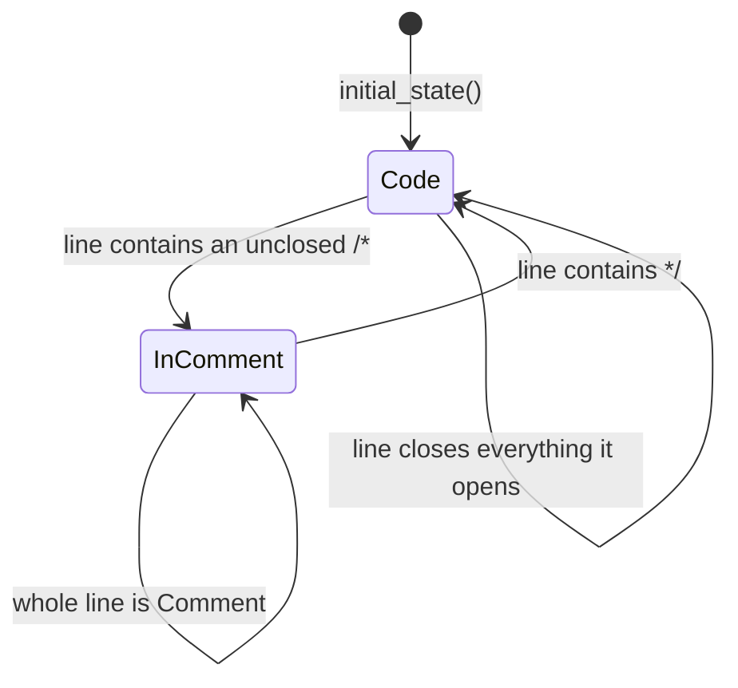

# syntax/lang_json

The JSON (and JSONC) lexer. It implements `@syntax.LineTokenizer` with a
compile-time `lexmatch` DFA.

`JsonTokenizer` is the whole public surface. Hosts, examples, and tests select it
explicitly; reusable viewer core packages must not import it.

## How text becomes color

`lang_json` classifies text; it does not contain a palette. For each line it
returns UTF-16 ranges tagged as `Attribute`, `String`, `Number`, `Comment`, and
so on. The viewer fills untagged whitespace as `Plain`, converts every tag to a
Monaco token color id, and resolves that id through the active theme's CSS
variables.

```text
JSON text -> LineToken ranges -> HighlightTag -> color id -> theme CSS color
```

For example, in `{ "answer": 42 }`, the lexer emits `Delimiter` for the braces,
`Attribute` for `"answer"`, and `Number` for `42`. The shared theme maps those
to the punctuation, variable, and number colors respectively. Changing a theme
therefore changes JSON colors without changing this lexer.

## Reading a token stream

```mbt check
///|
/// Renders each token as `text|tag`, carrying tokenizer state line to line.
fn annotate(
  tokenizer : &@syntax.LineTokenizer,
  lines : ArrayView[String],
) -> Array[String] {
  let rendered = []
  for line in lines; state = tokenizer.initial_state() {
    let (tokens, next_state) = tokenizer.tokenize_line(line, state)
    for token in tokens {
      rendered.push("\{line[token.start:token.end].to_owned()}|\{token.tag}")
    }
    continue next_state
  }
  rendered
}
```

## Property names versus string values

A JSON string is tagged by its *role*, not its shape: a string followed by `:`
is a property name, every other string is a value. The lexer decides this with
one lookahead over the remainder of the line rather than by parsing structure.

```mbt check
///|
test "a colon after a string makes it a property name" {
  debug_inspect(
    annotate(@lang_json.JsonTokenizer(), [
      "{ \"name\": \"moonbit\", \"version\": 3 }",
    ]),
    content=(
      #|[
      #|  "{|Delimiter",
      #|  "\"name\"|Attribute",
      #|  ":|Delimiter",
      #|  "\"moonbit\"|String",
      #|  ",|Delimiter",
      #|  "\"version\"|Attribute",
      #|  ":|Delimiter",
      #|  "3|Number",
      #|  "}|Delimiter",
      #|]
    ),
  )
}
```

Literals and numbers get their own classes, and anything unquoted that is not a
literal is `Invalid` — JSON has no bare words, so surfacing them as invalid is
the whole diagnostic value this lexer can offer without a parser.

```mbt check
///|
test "JSON literals are Constant and bare words are Invalid" {
  debug_inspect(
    annotate(@lang_json.JsonTokenizer(), [
      "[true, false, null, -1.5e3, undefined]",
    ]),
    content=(
      #|[
      #|  "[|Delimiter",
      #|  "true|Constant",
      #|  ",|Delimiter",
      #|  "false|Constant",
      #|  ",|Delimiter",
      #|  "null|Constant",
      #|  ",|Delimiter",
      #|  "-1.5e3|Number",
      #|  ",|Delimiter",
      #|  "undefined|Invalid",
      #|  "]|Delimiter",
      #|]
    ),
  )
}
```

## Cross-line state

This is the one lexer feature that needs state: a JSONC `/* … */` block comment
runs past the end of a line, so the closing state must survive into the next
`tokenize_line` call. The shared `TokenizerState` is empty in normal code and
contains only `b'c'` inside a block comment, so the lexer treats it as a single
in-comment flag rather than a general mode stack.



```mbt check
///|
test "a block comment carries across lines through TokenizerState" {
  debug_inspect(
    annotate(@lang_json.JsonTokenizer(), [
      "{ /* start", "still inside", "done */ \"k\": 1 }",
    ]),
    content=(
      #|[
      #|  "{|Delimiter",
      #|  "/*|Comment",
      #|  " start|Comment",
      #|  "still inside|Comment",
      #|  "done |Comment",
      #|  "*/|Comment",
      #|  "\"k\"|Attribute",
      #|  ":|Delimiter",
      #|  "1|Number",
      #|  "}|Delimiter",
      #|]
    ),
  )
}
```

Because the flag is the entire state, re-lexing a line only needs to know
whether the previous line ended inside a comment.

```mbt check
///|
test "the in-comment flag is the whole state" {
  let tokenizer : &@syntax.LineTokenizer = @lang_json.JsonTokenizer()
  let initial = tokenizer.initial_state()
  let (_, opened) = tokenizer.tokenize_line("{ /* start", initial)
  let (_, closed) = tokenizer.tokenize_line("done */", opened)
  debug_inspect(
    (initial, opened, closed),
    content=(
      #|(TokenizerState(""), TokenizerState("c"), TokenizerState(""))
    ),
  )
}
```

## Boundaries and checks

This package may depend only on `syntax`. It uses neither `@syntax.push_token`
nor `@syntax.is_capitalized`. The complete API is `pkg.generated.mbti`; the
line-tokenizer contract and the porting rules live in `syntax/README.mbt.md`.

```sh
moon test --target js syntax/lang_json
```
