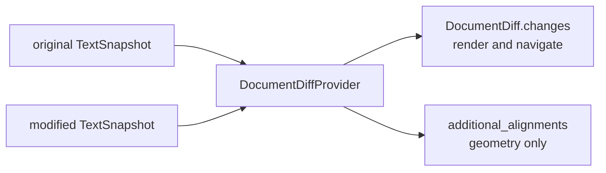

# viewer/common/diff

Renderer-neutral document-diff contracts and the built-in synchronous Core
Myers provider. The package has no DOM or editor-widget dependency.



## Computing a diff

The built-in provider accepts immutable, LF-normalized snapshots. A line
change may also contain one-based UTF-16 character mappings.

```mbt check
///|
let strict_options : @diff.DocumentDiffOptions = {
  ignore_trim_whitespace: false,
}

///|
test "an edited line maps original and modified ranges" {
  let result = @diff.get_core_document_diff_provider().compute_diff(
    TextSnapshot("fn main {\n  println(1)\n}"),
    TextSnapshot("fn main {\n  println(2)\n}"),
    strict_options,
  )
  assert_eq(result.changes.length(), 1)
  assert_eq(result.changes[0].original, LineRange(2, 3))
  assert_eq(result.changes[0].modified, LineRange(2, 3))
  assert_true(result.additional_alignments.is_empty())
}
```

An insertion has an empty original range; a deletion has an empty modified
range. Identical inputs produce no changes.

```mbt check
///|
test "insertions keep half-open line-range semantics" {
  let inserted = @diff.get_core_document_diff_provider().compute_diff(
    TextSnapshot("a\nc"),
    TextSnapshot("a\nb\nc"),
    strict_options,
  )
  assert_eq(inserted.changes.length(), 1)
  assert_true(inserted.changes[0].original.is_empty())
  assert_eq(inserted.changes[0].modified, LineRange(2, 3))
}
```

## Whitespace and provider policy

`ignore_trim_whitespace` ignores only whitespace at each line's edges. The
contract deliberately has no fake millisecond timeout, timeout result, or move
option: providers expose only semantics they implement.

```mbt check
///|
test "trim whitespace can ignore re-indentation" {
  let provider = @diff.CoreDocumentDiffProvider()
  let original = @model.TextSnapshot("fn main {\nprintln(1)\n}")
  let modified = @model.TextSnapshot("fn main {\n  println(1)\n}")
  let strict = provider.compute_diff(original, modified, strict_options)
  let lenient = provider.compute_diff(original, modified, {
    ignore_trim_whitespace: true,
  })
  assert_eq(strict.changes.length(), 1)
  assert_true(lenient.changes.is_empty())
}
```

External providers implement `DocumentDiffProvider` and may fill
`additional_alignments` for ignored source rows. `LineRangeMapping`,
`DetailedLineRangeMapping`, and `RangeMapping` are public constructible values,
so no viewer-layer adapter is required. As in VS Code's
`lineRangeMappingFromRangeMappings`, touching changed rows must be grouped into
one hunk. Consecutive hunks are strictly separated, ordered on both sides, and
have equal unchanged gaps. The ViewModel normalizes full-line inner ranges and
rejects results that violate these invariants instead of repairing them in the
renderer.

```sh
moon test --target js viewer/common/diff
```
